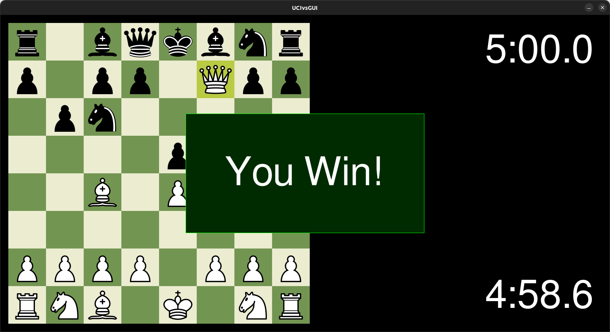

# UCIvsGUI
Play against any UCI chess engine with a PyGame application!

## How does it work?

This GUI uses the Python library PyGame to allow the user to play against a UCI engine. By keeping track of the mouse inputs and using the Python [chess library](https://python-chess.readthedocs.io/en/latest/), the GUI determines what squares the user is clicking on and performs and chess calculations necessary through the chess library. The chess library has a convenient module to communicate with a UCI chess engine through code. Although the visuals and controls may be superficial, this repository allows for chess developers to quickly test out their chess engines. This GUI also uses asyncio to run the chess engine on the side for a smoother chess experience.

## Setup

I recommend using Anaconda or venv to create a Python environment. You will need to install `chess`, `cairosvg`, and `pygame` through pip.

To actually run the application copy your engine exectutable's directory and run `python3 play.py -e [dir]`, where the last argument is your pasted directory.

## Some references

